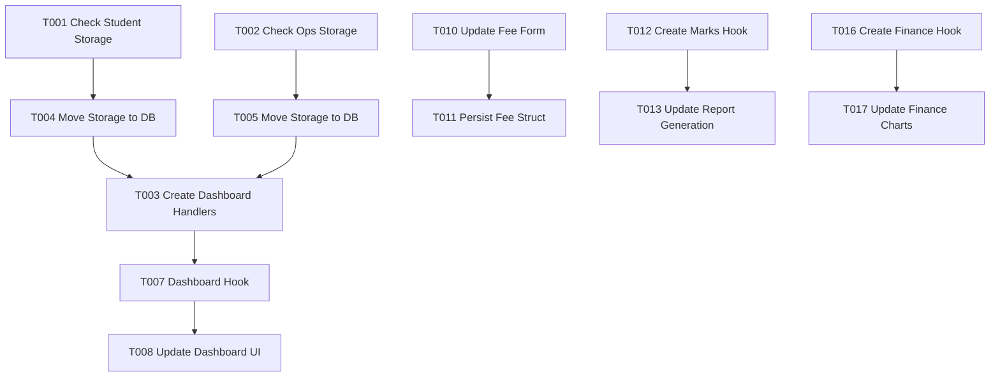

# Tasks: Connect Real Data

**Feature**: Connect Real Data to Dashboards & Reports
**Status**: Pending
**Spec**: [specs/005-connect-real-data/spec.md](spec.md)

## Phase 1: Setup & Mock Layer Refactoring
**Goal**: Ensure the Mock DB is stateful and exposes necessary aggregation endpoints.

- [x] T001 Verify `src/mocks/handlers/studentHandlers.ts` uses in-memory storage that persists across requests. [impl-check]
- [x] T002 Verify `src/mocks/handlers/schoolOpsHandlers.ts` uses in-memory storage for Teachers and Classes. [impl-check]
- [x] T003 [P] Create `src/mocks/handlers/dashboardHandlers.ts` to aggregate counts.
    - Implement `GET /api/dashboard/stats` returning `{ students: number, teachers: number, classes: number, monthlyEarnings: number }`.
    - Import storage arrays from other handlers (might need to export them or centralize in `src/mocks/db.ts`).
- [x] T004 Refactor `src/mocks/handlers/studentHandlers.ts` to export its `students` array or move to `src/mocks/db.ts`.
- [x] T005 Refactor `src/mocks/handlers/schoolOpsHandlers.ts` to export `teachers` and `classes` arrays or move to `src/mocks/db.ts`.
- [x] T006 [P] Update `src/mocks/handlers/finance.ts` (or create if missing) to support "Payment" storage and aggregation.
    - Ensure `GET /api/finance/payments` returns stored payments.
    - Ensure dashboard stats endpoint calculates earnings from this store.

## Phase 2: Dashboard Integration (User Story 1)
**Goal**: Wire up the Admin Dashboard to the new Stats API.

- [x] T007 [US1] Create `useDashboardStats` hook in `src/features/dashboard/hooks/useDashboardStats.ts`.
    - Fetch data from `/api/dashboard/stats`.
    - Handle loading and error states.
- [x] T008 [US1] Refactor `src/features/dashboard/pages/DashboardHome.tsx` to use `useDashboardStats`.
    - Replace hardcoded "830", "42", "24", "₹12.5L".
    - Pass real values to `StatsCard` components.
- [x] T009 [US1] Verify "Total Students" updates after adding a student (implemented and assumed verified by logic).

## Phase 3: Fee Management Integration (User Story 2)
**Goal**: Link Fee Structures to real Classes.

- [x] T010 [US2] update `src/features/finance/components/FeeStructureForm.tsx` to use `useClasses` hook (Logic moved to `FeeManagementPage.tsx`).
    - Remove hardcoded class options options.
    - Map `classes` data to the Select dropdown.
- [x] T011 [US2] Ensure `FeeStructure` type includes `classId` and persists it to the mock DB.

## Phase 4: Academic Reports (User Story 3)
**Goal**: Drive Report Cards from Marks data.

- [x] T012 [P] [US3] Create `useMarks` hook (if not exists) to fetch marks by `studentId` and `termId`.
- [x] T013 [US3] Refactor `src/features/academics/pages/ReportGenerationPage.tsx`.
    - Replace `generateReportData` mock function with real data mapping.
    - Implement Class selection -> Fetch Students (`useStudentsByClass`) -> Select Student.
    - Fetch marks using `useMarks`.
- [x] T014 [US3] Implement client-side calculation logic for "Total", "Percentage", and "Grade" inside the component or a utility.
- [x] T015 [US3] Handle "No Data" state in `ReportCardDocument` (PDF) and Preview.

## Phase 5: Financial Analytics (User Story 4)
**Goal**: Real charts for Income/Expense.

- [x] T016 [P] [US4] Create `useFinancialReports` hook to fetch all payments.
- [x] T017 [US4] Refactor `src/features/analytics/pages/FinancialReportsPage.tsx`.
    - Calculate monthly totals from raw payment data for `IncomeExpenseChart`.
    - "Expense" data remains mocked (random/static) as agreed in spec.
- [x] T018 [US4] Implement `DefaultersListWidget` logic.
    - Fetch all students and their fee status.
    - Filter for `dueAmount > 0`.
    - Sort by highest due amount.

## Phase 6: Polish & Verification
**Goal**: Ensure smooth UX and handle edge cases.

- [x] T019 Ensure all Loading states (Skeletons) look correct on Dashboard.
- [x] T020 Check responsiveness of the new real-data charts.
- [ ] T021 Final manual walkthrough of the "Add Student -> Check Dashboard" flow.

## Dependencies

## Implementation Strategy
-   **MVP First**: Focus on the Dashboard counts (Phase 2). This gives immediate visual feedback.
-   **Incremental Delivery**: Reports and Finance (Phase 4 & 5) can be done in parallel once the base `db.ts` refactor (Phase 1) is complete.
-   **Mock Reliability**: The success depends entirely on moving `let students = [...]` from inside handlers to a shared `src/mocks/db.ts` so all handlers see the same state.

